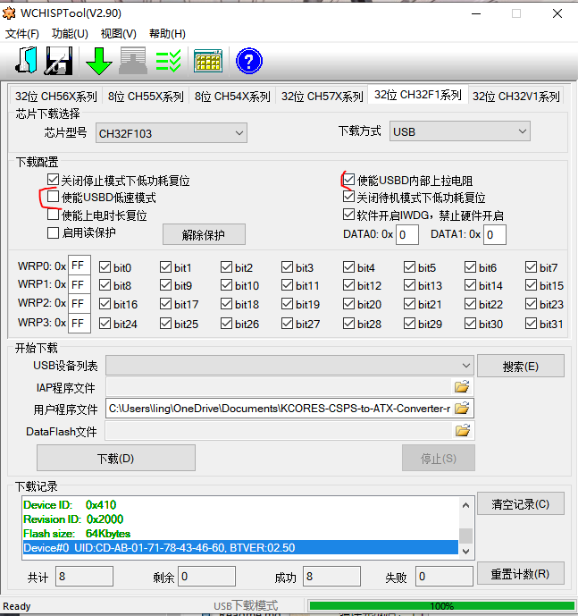

# 适用于STM32F103C8T6的arduino程序，提供oled显示和串口输出

引脚连接：

 *   PB8  -> CSPS SCL
 *   PB9  -> CSPS SDA
 *   G    -> CSPS GND
 *   PB10 -> 12832 SCL
 *   PB11 -> 12832 SDA
 *   V3   -> 12832 VCC
 *   G    -> 12832 GND

使用VSCode + PlatformIO编译, 编译命令：`platformio run -e bluepill_f103c8`

如果你给STM32F103C8T6安装了hid bootloader, 你可以直接运行`platformio run -e bluepill_f103c8 -t upload`编译并上传

2021/5/24：使用PlatformIO后可以成功兼容CH32F103C8T6。编译完成后需要手动使用WCHISPTool上传，参数如下：

通过usb连接电脑时需要接正面的microusb/typec口（有跳线帽的一侧）