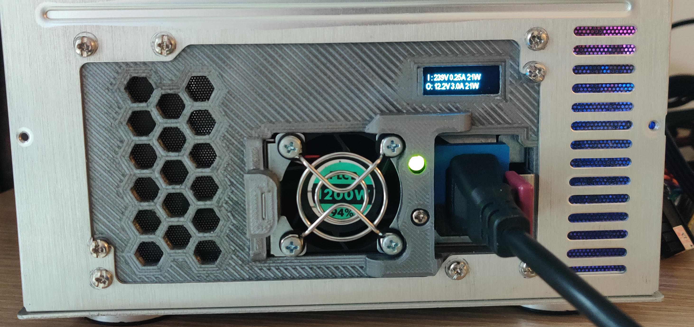
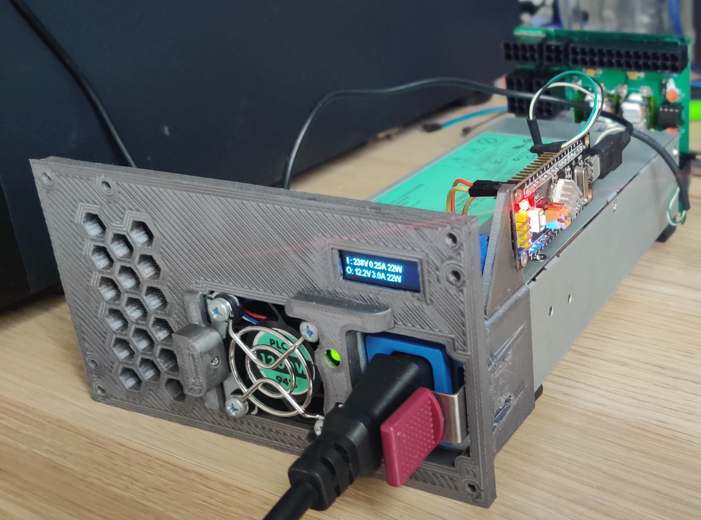
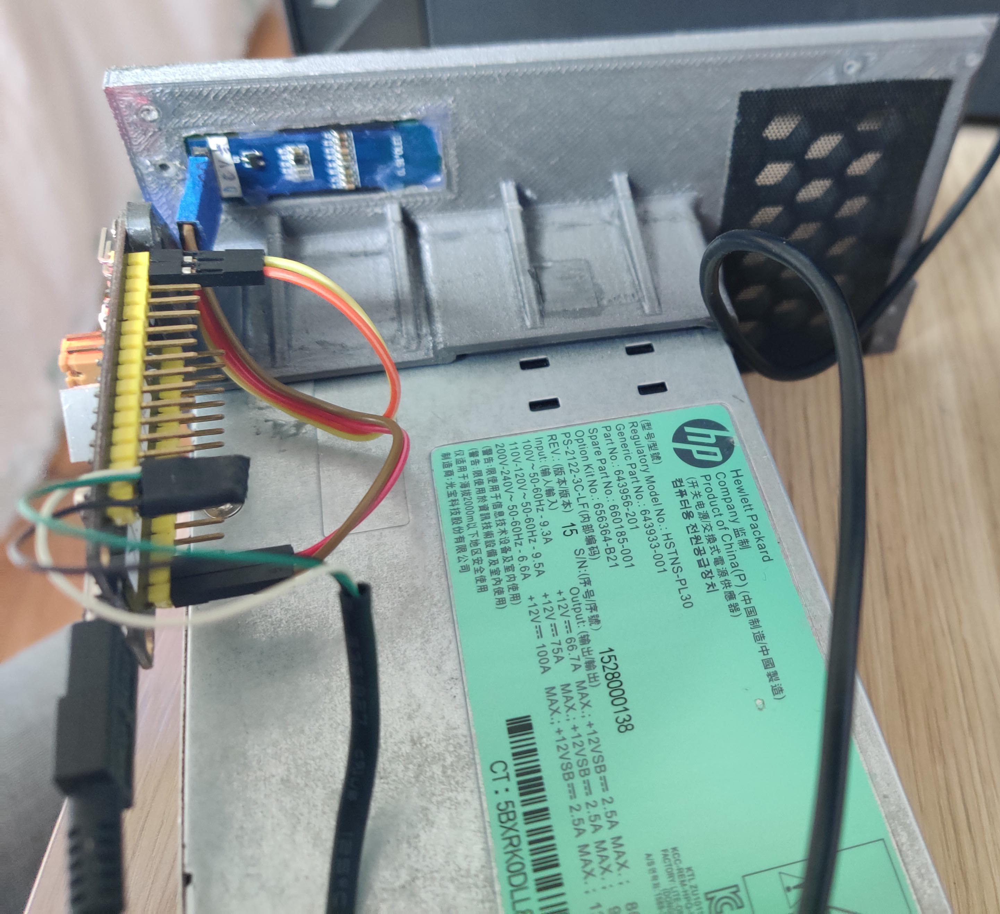

# 一个CSPS转ATX电源位的背板，相关项目： [KCORES-CSPS-to-ATX-Converter](https://github.com/KCORES/KCORES-CSPS-to-ATX-Converter)

需要打印的部分 (建议用abs/尼龙以免高温变形)：
- 
- STL/csps-atx-mount.stl （背板）
- STL/reinforcement1.stl （固定件一）
- STL/reinforcement2.stl （固定件二）

使用方法：
-
- 卸掉电源把手上的螺丝，把把手拿掉，螺丝备用
- 按住拨片把电源插入，左侧风扇位置金属外壳和背板平行，右侧和限位块接触
- 把固定件一和固定件二放到对应位置，用万能胶固定
- 胶干了以后把把手螺丝拧到固定件螺丝孔位

显示屏为ssd1306驱动的0.91寸128x32分辨率oled屏，用热熔胶固定到对应位置，单片机为stm32f103c8t6。程序及引脚接法见 [main.cpp](Arduino/KCORES_Link_V1/src/main.cpp)